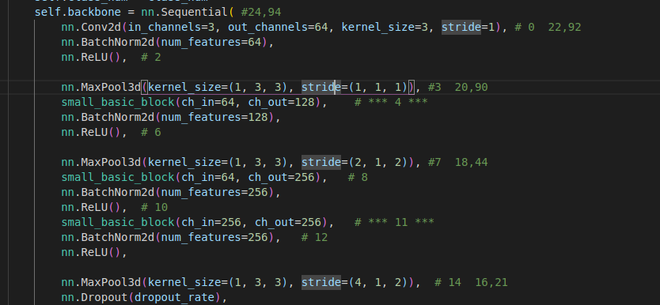

### LPR模型导出难点
1. 网络中使用了`nn.MaxPool3d`层，Ascend NPU也不支持该算子。     
        
观察发现：      
- `kernal_size`的参数作用在`channel`维度上的始终是1，也就是和普通的maxpool的过程相同        
- `stride`的参数作用在`channel`维度上的会改变，也就是挑选不同的`channel`来做普通的`maxpool`操作。       
使用如下定义去替换这个操作：        
```python
class MaxPool1_3d(nn.Module):
    def __init__(self, kernel_size, stride, padding=(0,0,0)):
        super(MaxPool1_3d, self).__init__()
        assert (kernel_size[0] == 1), "kernal_size in 0 dim must be 1"
        assert (padding[0] == 0), "pandding in 0 dim must be 0"
        self.stride = stride
        self.max_pool_2d = nn.MaxPool2d(kernel_size[1:], self.stride[1:], padding[1:])

    def forward(self, x):
        y = x.index_select(1, torch.arange(0, x.size()[1], self.stride[0], dtype=torch.int64))
        return self.max_pool_2d(y)
```

2. 将`LPRNet`网络结构的`forward`中的`f_mean = torch.mean(f_pow)`替换为`f_mean = torch.mean(f_pow.flatten(1), 1, keepdim=True)`，
解决onnx->om时`ReduceMean`节点维度报错。

### 预处理
#### refine model
1. 将输入resize到(h x w)48 X 120, 通道顺序为rgb
2. 将图像像素减127.5,除128 

#### LPR model
1. 将输入resize到(h x w)24 X 94, 通道顺序为rgb
2. 将图像像素减127.5,除128

### om 模型使用
使用`LPRecoginition`类。      
`LPR_refinenet_withAipp.om`， `LPRNet__iteration_100000-sim_withAipp.om` ： `aippMode`=`BGR_PACKAGE`            

`GetLabelText`： 获取标签列表

```
CHARS = ['京', '沪', '津', '渝', '冀', '晋', '蒙', '辽', '吉', '黑',
         '苏', '浙', '皖', '闽', '赣', '鲁', '豫', '鄂', '湘', '粤',
         '桂', '琼', '川', '贵', '云', '藏', '陕', '甘', '青', '宁',
         '新',
         '港', '学', '使', '警', '澳', '军', '空', '海', '领',
         '0', '1', '2', '3', '4', '5', '6', '7', '8', '9',
         'A', 'B', 'C', 'D', 'E', 'F', 'G', 'H', 'J', 'K',
         'L', 'M', 'N', 'P', 'Q', 'R', 'S', 'T', 'U', 'V',
         'W', 'X', 'Y', 'Z', 'I', 'O', '-'
         ]
```