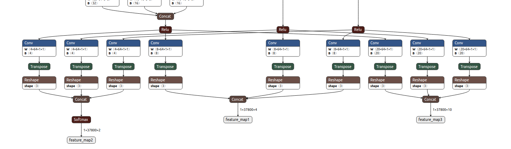

### RetinaFace模型导出并没有难点
`Retinaface`模型转换过程中会遇到和`Yolov5`相同的问题，`FPN`中的上采样算子，依然采用类似的替换。     
转换出来的`onnx`模型中最后几层如图：        
      
有了`yolov5`模型的趟坑经验，看到这么多的`Transpose`算子就说怕不怕？！       
还好这个层离输出不远，为了速度和性能，只能从上面的`Conv`层就将结果拿到，后续的实现在cpu上，这里为了省事，后续的网络层借用[ncnn](https://github.com/Tencent/ncnn)中的层直接搭建，由于ncnn自带arm优化，省了很多开发量。

### Preprocess
```
model_inputs: 1,3,960,960
channels_order: BGR

--mean {104, 117, 123}

```