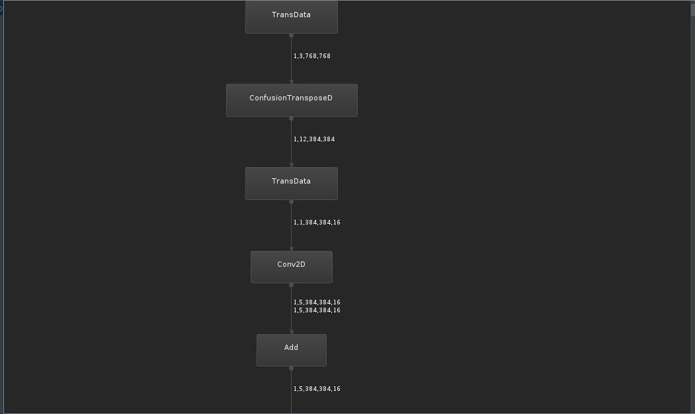
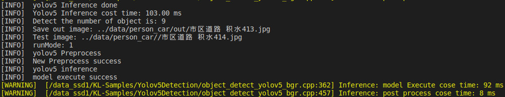

### Yolov5 针对Ascend模型导出难点
#### 1. Resize算子不支持        
yolov5中32倍下采样后的featuremap需要`resize`到原来2倍与16倍下采样的featuremap做融合，Ascend NPU在CANN 20.2之前的版本不支持上采样算子，由于该层处于网络的中段，不宜采用将该层之后的所有的网络结构在cpu实现，作为后处理一部分，只能使用其他支持的算子进行替换。       
可喜可贺的是该层的上采样采用的是**最近邻插值**模式，因此可使用如下定义的层进行替换。        
```python
class NearestUpsample(nn.Module):
    def __init__(self):
        super(NearestUpsample, self).__init__()
        pass

    def forward(self, x):
        y = x.unsqueeze(3).unsqueeze(5)
        y = torch.cat([y, y], dim=3)
        y = torch.cat([y, y], dim=5)
        
        y = y.reshape(x.size(0), x.size(1), x.size(2) * 2, x.size(3) * 2)
        return y
```
由于该算子并没有权重信息，因此可以直接修改载入的模型。      
```python
for k, m in model.named_modules():
    m._non_persistent_buffers_set = set()  # pytorch 1.6.0 compatibility
    if isinstance(m, models.common.Conv):  # assign export-friendly activations
        if isinstance(m.act, nn.Hardswish):
            m.act = Hardswish()
        elif isinstance(m.act, nn.SiLU):
            m.act = SiLU()
    elif isinstance(m, nn.Upsample):
        print(k, " -> ", m)
        if k == "model.11":
            model.model[11] = NearestUpsample()  #nn.Upsample([40, 40], None, 'nearest')
            model.model[11].f = -1
            model.model[11].i = 11
        elif k == "model.15":
            model.model[15] = NearestUpsample()  #nn.Upsample([80, 80], None, 'nearest')
            model.model[15].f = -1
            model.model[15].i = 15
```

#### 2. Focus层中的切片操作不支持
Focus层中包含了一个下采样2倍的操作，输出为`onnx`模型后如图所示：        
      
Ascend NPU对slice算子也不支持，但是由于该操作处于网络的开始，那么就可以在导出`onnx`模型后将该节点删除，将输入数据直接接入到下面的`Conv`层中，该切片操作可参考源码中的实现，在图片预处理中完成，达到规避不支持的算子操作。
```python
torch.cat([x[..., ::2, ::2], x[..., 1::2, ::2], x[..., ::2, 1::2], x[..., 1::2, 1::2]], 1)
```
计算原理其实比较简单，可参看知乎[深入浅出Yolo系列之Yolov5核心基础知识完整讲解](https://zhuanlan.zhihu.com/p/172121380)中的`Focus结构`。     
如图所示        
      
其实就像是移动图像起始位置然后使用最近邻模式进行4次`resize`到原尺寸的一半，那么使用C++做外部预处理的话代码如下，当然并没有采用opencv的`resize`方法去实现。
```C++
Result Utils::Focus(const std::vector<cv::Mat> &rgb_channels, std::vector<cv::Mat> &splited_channels)
{
    splited_channels.clear();
    splited_channels.resize(rgb_channels.size() * 4);
    if (rgb_channels[0].type() != CV_32FC1 || rgb_channels[1].type() != CV_32FC1 || rgb_channels[2].type() != CV_32FC1)
    {
        ERROR_LOG("The bgr_channels type must be CV_32FC1");
        return FAILED;
    }
    int dest_width = rgb_channels[0].cols / 2;
    int dest_height = rgb_channels[0].rows / 2;
    for (size_t ch = 0; ch < rgb_channels.size(); ch ++)
    {
        const cv::Mat &ch_mat = rgb_channels[ch];

        cv::Mat dest_mat00(dest_width, dest_height, CV_32FC1);
        cv::Mat dest_mat01(dest_width, dest_height, CV_32FC1);
        cv::Mat dest_mat10(dest_width, dest_height, CV_32FC1);
        cv::Mat dest_mat11(dest_width, dest_height, CV_32FC1);
        for (int row = 0; row < dest_height; row ++)
        {
            for (int col = 0; col < dest_width; col ++)
            {
                dest_mat00.at<float>(row, col) = ch_mat.at<float>(2* row + 0, 2 * col + 0);
                dest_mat01.at<float>(row, col) = ch_mat.at<float>(2* row + 0, 2 * col + 1);
                dest_mat10.at<float>(row, col) = ch_mat.at<float>(2* row + 1, 2 * col + 0);
                dest_mat11.at<float>(row, col) = ch_mat.at<float>(2* row + 1, 2 * col + 1);
            }
        }
        // 这里排列顺序对类别的confidence影响较大
        splited_channels[0 + ch] = std::move(dest_mat00);
        splited_channels[6 + ch] = std::move(dest_mat01);
        splited_channels[3 + ch] = std::move(dest_mat10);
        splited_channels[9 + ch] = std::move(dest_mat11);
    }

    return SUCCESS;
}
```
代码中的注释很重要，一定要按照源码的顺序去做`concat`！      

这样的替换虽然可以达到规避效果，但是这使得网络的结构遭到破坏，对于后续将流程优化为`解码 -> 预处理 -> 模型推理`全在NPU中实现产生了断层。     
官方在yolov5的3.1或是4.0版本中的替换方案如下
```python
class Focus(nn.Module):
    # Focus wh information into c-space
    def __init__(self, c1, c2, k=1, s=1, p=None, g=1, act=True):  # ch_in, ch_out, kernel, stride, padding, groups
        super(Focus, self).__init__()
        self.conv = Conv(c1 * 4, c2, k, s, p, g, act)
        self.contract = Contract(gain=2)

    def forward(self, x):  # x(b,c,w,h) -> y(b,4c,w/2,h/2)
        # return self.conv(torch.cat([x[..., ::2, ::2], x[..., 1::2, ::2], x[..., ::2, 1::2], x[..., 1::2, 1::2]], 1))
        return self.conv(self.contract(x))


class Contract(nn.Module):
    # Contract width-height into channels, i.e. x(1,64,80,80) to x(1,256,40,40)
    def __init__(self, gain=2):
        super().__init__()
        self.gain = gain

    def forward(self, x):
        N, C, H, W = x.size()  # assert (H / s == 0) and (W / s == 0), 'Indivisible gain'
        s = self.gain
        x = x.view(N, C, H // s, s, W // s, s)  # x(1,64,40,2,40,2)
        x = x.permute(0, 3, 5, 1, 2, 4).contiguous()  # x(1,2,2,64,40,40)
        return x.view(N, C * s * s, H // s, W // s)  # x(1,256,40,40)
```
是的，官方其实给出了替换方案，只是以注释的形式，并没有真正采用。看一下转出的`onnx`模型长啥样。      
        
不得不说，yolov5工程友好度基本上可以颁奖最佳了！但是测试后很快发现了一个问题！        
模型转为`om`后可视化为      
     
引入了`Transpose`算子……     
实测推理速度变慢了4-5倍,并且结果还有出入，不过不重要，这个速度基本上输入不能用了，就不需要在乎结果对不对了！               
     
**划重点**：Ascend NPU对`Transpose`算子虽然支持，但是计算速度极慢！所以尽量避免引入和规避这个算子！     
那么问题又回到了原点，如何高效的替换这个算子操作？！细品`Focus结构`这个计算方式，它的这种计算方式其实就是在做`group`卷积！根据卷积的计算方式，只是需要固定权重而已。        
使用最直观的方式：      
定义4个`group`卷积分别将输入数据进行计算，`kernal size`定义为`2x2`，`stride`为2，`padding`为0。
定义四个`group`卷积核的权重分别为       
```
1 | 0    0 | 0    0 | 1    0 | 0
——|——    ——|——    ——|——    ——|——
0 | 0    1 | 0    0 | 0    0 | 1
```         
这样虽然可以达到目的，但是通常我们使用的卷积核的尺寸都是奇数的存在，这样的卷积核在数学计算上的考虑在这里不展开，但是读过推理框架源码如[ncnn](https://github.com/Tencent/ncnn)的话会清楚，底层实现加速上会对类似3x3的卷积进行特殊加速，这个2x2的卷积核对加速并不友好，再次修改如下，直接上代码：
```python
class Focus2(nn.Module):
    # Focus wh information into c-space
    def __init__(self, c1, c2, k=1, s=1, p=None, g=1, act=True): # ch_in, ch_out, kernel, stride, padding, groups
        super(Focus2, self).__init__()
        self.conv_weight1 = nn.Parameter(torch.Tensor([0, 0, 0, 0, 1, 0, 0, 0, 0] * 3).view(3, 1, 3, 3))
        self.conv_weight1.requires_grad = False

        self.conv_weight2 = nn.Parameter(torch.Tensor([0, 0, 0, 0, 0, 1, 0, 0, 0] * 3).view(3, 1, 3, 3))
        self.conv_weight2.requires_grad = False

        self.conv_weight3 = nn.Parameter(torch.Tensor([0, 0, 0, 0, 0, 0, 0, 1, 0] * 3).view(3, 1, 3, 3))
        self.conv_weight3.requires_grad = False

        self.conv_weight4 = nn.Parameter(torch.Tensor([0, 0, 0, 0, 0, 0, 0, 0, 1] * 3).view(3, 1, 3, 3))
        self.conv_weight4.requires_grad = False

        self.stride = 2
        self.pad = 1

        self.conv = Conv(c1 * 4, c2, k, s, p, g, act)

    def forward(self, x: torch.Tensor): # x(b,c,w,h) -> y(b,4c,w/2,h/2)
        b, c, h, w = x.shape
        out1 = F.conv2d(x, self.conv_weight1, None, stride=self.stride, padding=self.pad, groups=c)
        out2 = F.conv2d(x, self.conv_weight2, None, stride=self.stride, padding=self.pad, groups=c)
        out3 = F.conv2d(x, self.conv_weight3, None, stride=self.stride, padding=self.pad, groups=c)
        out4 = F.conv2d(x, self.conv_weight4, None, stride=self.stride, padding=self.pad, groups=c)

        return self.conv(torch.cat([out1, out3, out2, out4], 1))
```
这个基本上算是达到要求了。后续只是修改载入的模型，将该结构嫁接到原来的`Focus`上。       
最后的结构图如下：      
     
实测推理速度        
       
并且结果完美对的上！        
**不可方物**