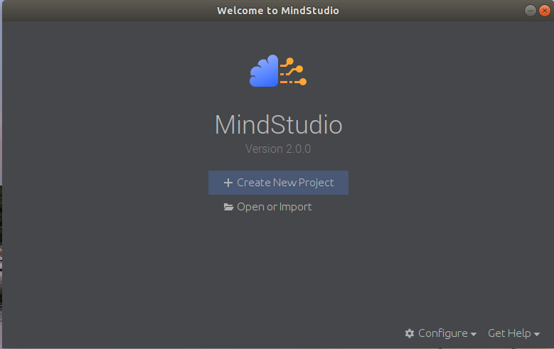
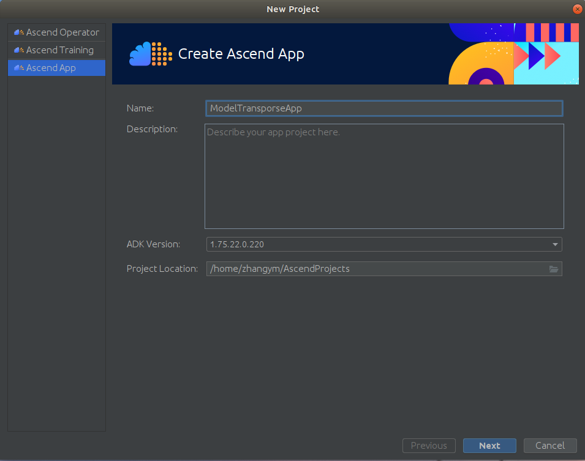
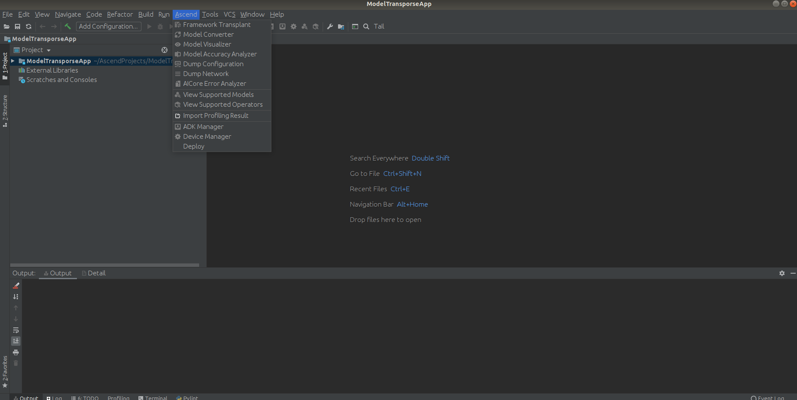
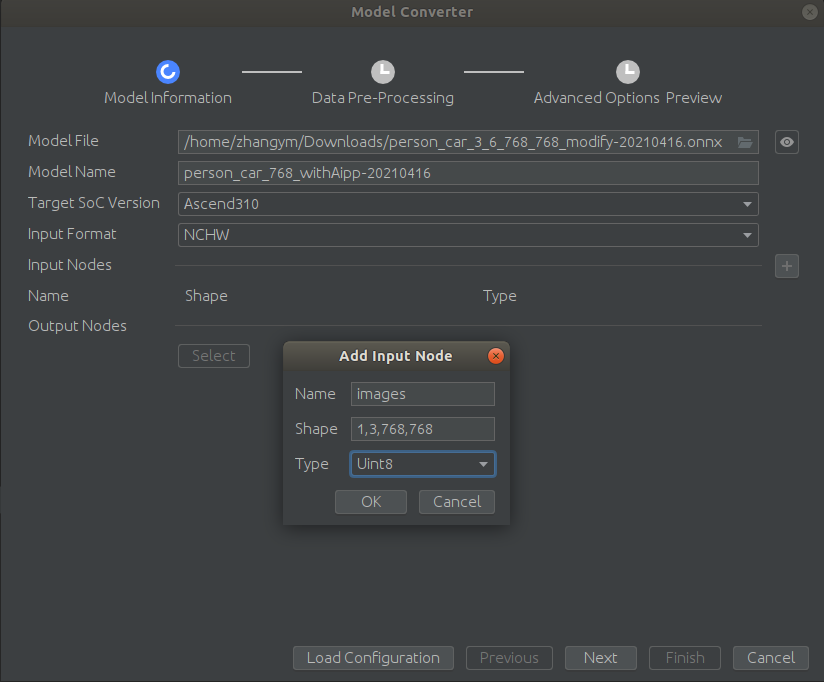
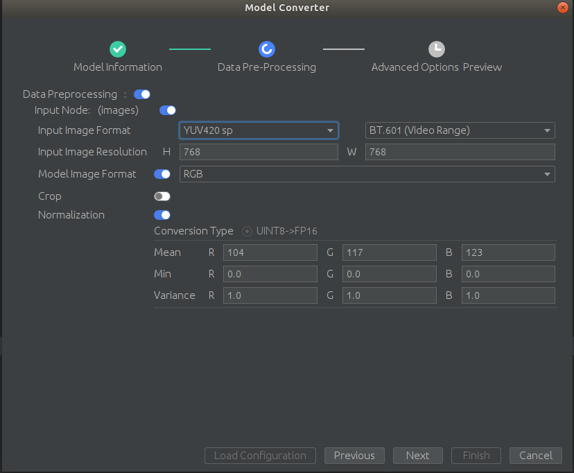
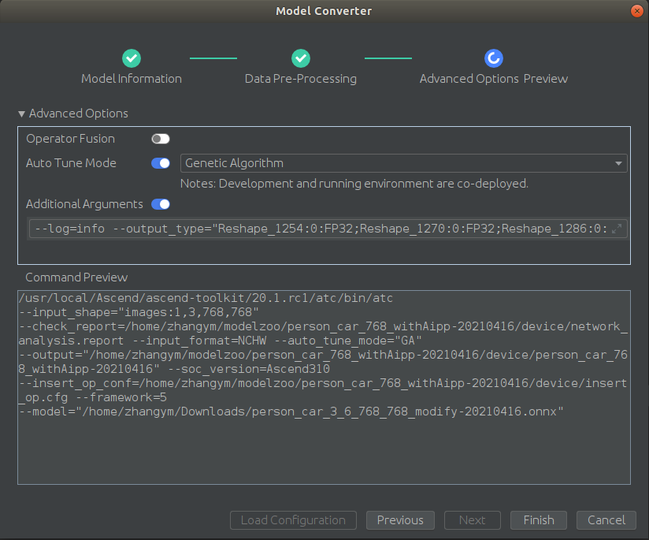
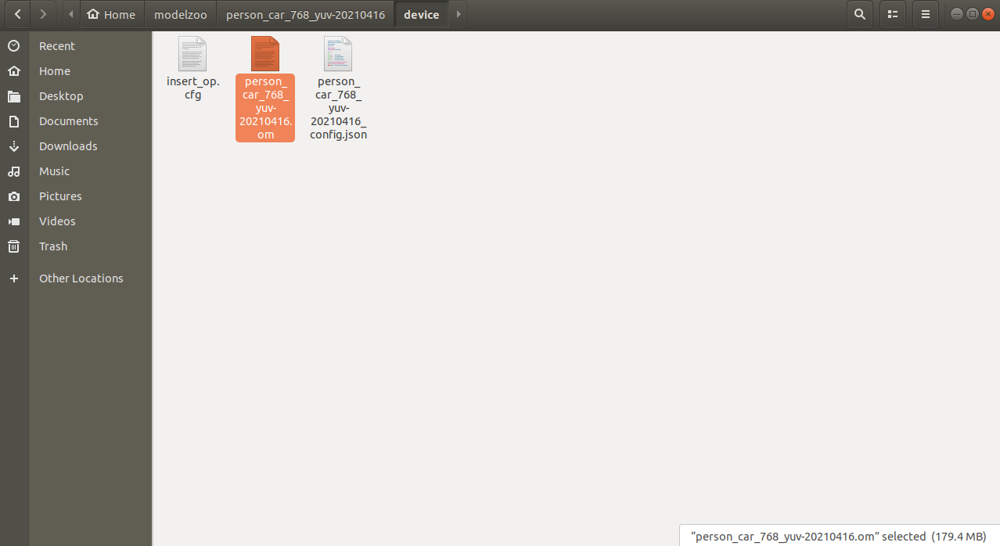

### 背景
本工程包含常用深度学习网络的模型导出工程[ModelExport](./ModelExport)和相应的cpp工程[CppProjects](./CppProjects)。       
环境：
```
硬件配置： Atlas 800 推理服务器（型号 3000） + Atlas 300I 推理卡（型号 3000） （4×A310 Core）
系统环境： ubuntu18.04 server aarch64
开发套件： CANN 20.0
```
系统及环境配置可参照[昇腾CANN 20.0 推理场景文档](https://support.huaweicloud.com/instg-3000-A800_3000_3010/atlasdc_03_0001.html)进行系统及软件环境配置；

**注意**：现最新版本的CANN版本（20.2）与该版本某些接口和模型转换支持上相差甚大，可根据相应版本文档进行修改，经不完全测试，在高版本进行转换后的`om`模型可在低版本上加载运行。

### 模型转换流程
昇腾系列的模型转换可使用命令行工具`ATC`和可视化工具[MindStudio](https://www.hiascend.com/zh/software/mindstudio)。
在CANN 20.0开发套件中所包含的`ATC`工具只支持`Caffe`和`TensorFlow`模型的转化，但是不支持`onnx`模型的转换，因此建议使用基于CANN20.1或更高的版本的`MindStudio`进行模型转换，因此本工程基于`MindStudio`软件进行模型转换的讲解。     
`ATC`模型转换可参考[ATC工具使用指导](https://support.huaweicloud.com/ti-atc-A800_3000_3010/altasatc_16_002.html)进行使用。        
**模型导出注意事项**：      
1. 模型导出为`onnx`时必须设置`opset_version=11`；   
2. pytorch版本不宜太低，导出的模型需要包含节点的`name`信息，建议1.6及以上；     
3. 尽量使用[onnx-simplifier](https://github.com/daquexian/onnx-simplifier)将模型进行简化，避免引入奇怪的算子进去；      
4. Atlas的模型要求动态batch或者动态尺寸只能二选一，可根据实际情况选择。     

`MindStudio`可根据[文档](https://support.huaweicloud.com/MindStudioC76/index.html)在**x86虚拟机**中进行安装与使用！是的，就是**x86架构的Ubuntu系统！**      
1. 启动界面        
        
选择创建新工程      
2. 创建模型转换的工程       
由于并不使用这个软件进行项目开发，只是使用其中的模型转换功能，因此这里选择创建`Ascend App`。
       
后续创建空工程，最后完成就可以了。      
进入后发现，这不就是`Pycharm`吗？！说好的自主研发呢！不重要，但是菜单栏里确实多了些东西！`Ascend`选项！       
3. 模型转换     
        
选择`Model Converter`会出现如下配置界面       
        
其中：      
`ModelFile：`支持caffe， tensorflow， onnx等模型的转换，当选择不同的模型的时候，下面选项也会有所不同，已`onnx`转换为例。        
`ModelName：`输出的`om`模型的名字。     
`Target Soc Version：`根据硬件芯片的型号选择，这里用的是`Ascend310`。       
`InputFormat：`网络输入的维度顺序，一般的常用框架输入的维度顺序为`NCHW`，tensorflow的维度输入顺序为`NHWC`，重点注意。       
`InputNodes：`当选择的模型源是caffe或者tensorflow，那么会自动识别输入的节点，这里选择的是`onnx`模型，并没有自动识别，那么就需要根据实际的输入进行增加，
增加的输入节点名字和形状要与`onnx`模型一样，可使用[netron](https://github.com/lutzroeder/netron)可视化查看，输入的数据类型`Type`一般选择`FP32`或者`Uint8`，当选择`FP32`后意味着后续不再支持`Aipp`的设置，预处理需要在外部实现，且维度顺序需要与上面的`InputFormat`的设置对应，当选择`Uint8`后必须选择后续的`Aipp`的设置。               
`OutputNodes：`由于选择`onnx`模型，没有解析出来，后续指定。   
4. 模型内数据预处理     
      
其中：      
`Input Image Format：`一般选择`YUV420 sp`或者`BGR package`，其中`YUV420 sp`的话一般操作是`NPU`解码后，调用`vpc`相关操作进行前期预处理，然后直接进行网络推理，整个过程都在设备端，且数据格式都为`YUV420 sp`，由于`vpc`操作输入暂时（好像）只支持`YUV420 sp`和`YVU420 sp`格式，如果联合使用，并没有太多选择；当选择`BGR package`的话一般通过`opencv`读取图片，然后输入网络，也可以使用`vpc`的`jpegd`的方法，但是对于程序代码使用并不友好。        
`ModelImageFormat：`是指网络输入的时候数据格式及通道顺序，应该注意的是，为了和原模型结果相同，请确定通道顺序。      
`Normalization：`其中的`Mean`和`Variance`的计算公式为(x - Mean) * Variance；`Min`不重要……       
5. 进阶设置     
       
其中：      
`Operator Fusion：`当需要进行量化后的模型精度对比时才会使用，平常情况下关闭就好。       
`Auto Tune Mode：`使用`GA`或者`LR`算法优化权重，或者两者同时使用，`LR`算法优化的话必须在运行环境的主机上开启才可以，所以一般使用`GA`算法就可以了。      
`Addition Arguments：`上述在选择`onnx`模型的时候由于不能指定输出节点，那么就需要在这个选项中来自定义需要的参数。        
例如：
```
--log=info
--output_type="Reshape_1254:0:FP32;Reshape_1270:0:FP32;Reshape_1286:0:FP32"
--out_nodes="Reshape_1254:0;Reshape_1270:0;Reshape_1286:0"
```     
需要在模型转换过程中查看输出信息，那么就需要指定`log`级别，默认不会打印详细信息；       
指定输出节点`out_nodes`和输出节点的数据类型`output_type`,格式参考[ATC](https://support.huaweicloud.com/ti-atc-A800_3000_3010/altasatc_16_003.html)中的说明。        
**注意**：一定要指定输出的数据类型，模型默认输出的数据类型为`FP16`，那么在C++后处理时会出现问题。       
6. 转换过程中的输出     
完成上面的步骤后可以点击`Finish`进行模型转换，由于开启了`GA`优化，但是并不是所有的算子都可以进行优化，因此在转换过程中可能会看到一些报错，找不到相关优化算子，这些并不影响，最后模型依然可以转换成功，如果存在不支持的层，也可以查看转换过程中的输出信息来定位，然后进一步修改网络结构。        
7. 输出的om模型     
模型转换成功后会在主目录的`modelzoo`文件夹下。      
     
其中：      
`om`文件即为转换成功的模型，可以在`MindStudio`中的`Ascend`菜单的`Model Visualizer`进行可视化查看与对比。
`cfg`文件为`Aipp`预处理所设置的参数。       
`json`文件模型转换所设置的操作和参数。      

### Yolov5系列模型转换
原始工程使用[yolov5](https://github.com/ultralytics/yolov5)     
模型导出使用[yolov5_export](./ModelExport/yolov5_export)
用法：      
```sh
python3 models/export.py --img-size 640 640 --weights /path/to/yolov5/model.pt
```     
会输出含有转换日期的`onnx`到原模型同级目录下。      

### RetinaFace模型转换
原始工程使用[Pytorch_Retinaface](https://github.com/biubug6/Pytorch_Retinaface)        
模型导出使用[RetinaFace_export](./ModelExport/RetinaFace_export)        
用法：      
```sh
python3 retinaface_export.py --img-size 640 640 --weights /path/to/retinaface/model.pt
```

### LPR模型转换
原始工程使用[HyperLPR](https://github.com/szad670401/HyperLPR)        
模型导出使用[LPR_export](./ModelExport/LPR_export)        
用法：      
```sh
python3 LPR_export.py --weights /path/to/LPR/model.pt
```